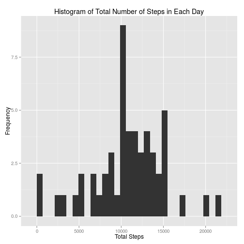
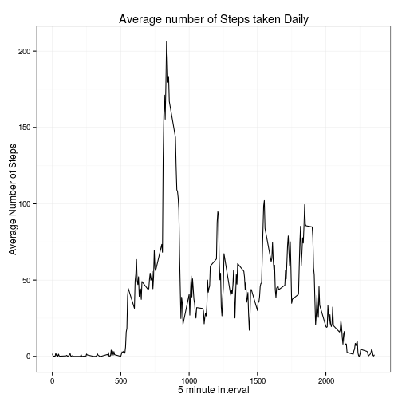
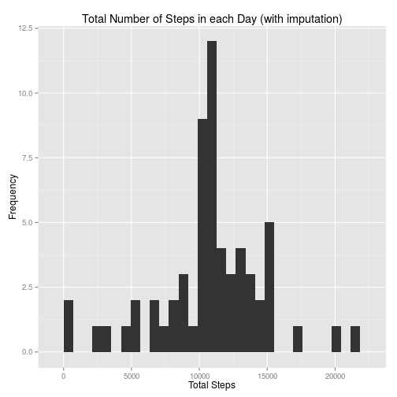
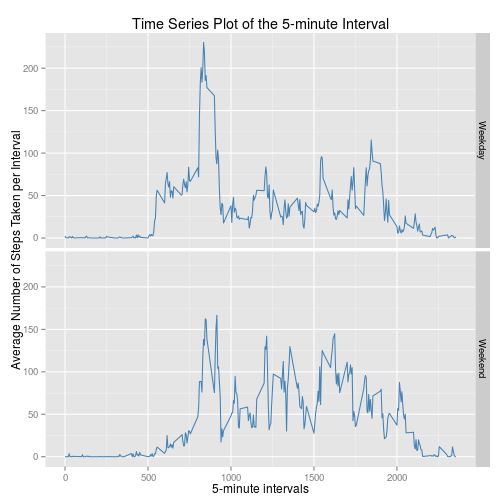

Load Options:


```r
suppressPackageStartupMessages(library(dplyr))
suppressPackageStartupMessages(library(data.table))
suppressPackageStartupMessages(library(ggplot2))
suppressPackageStartupMessages(library(lubridate))
```


## Loading and preprocessing the data

##### Show any code that is needed to:  
- Load the data (i.e. read.csv())  
- Process/transform the data (if necessary) into a format suitable for your analysis
 

```r
activity <- read.table(unz("activity.zip", "activity.csv"), header = T, 
                       quote = "\"", sep=",", stringsAsFactors = FALSE)

## Convert the date variable from a factor to a date
activity$date <- as.Date(as.character.Date(activity$date))
activity_df <- tbl_df(activity)
activity_df <- na.omit(activity)
```

## What is mean total number of steps taken per day?
  - Calcuate the total number of steps taken per day
  - Make a histogram of the total number of steps taken each day
  
### Calcuate the total number of steps taken per day


```r
total.step <- activity_df %>% 
  group_by(date) %>%
  filter(!is.na(steps)) %>%
  summarise(daily.step = sum(steps, na.rm = TRUE))
  
## Histogram of the total number of steps taken
ggplot(total.step, aes(daily.step)) +
  geom_histogram(stat = "bin") + 
  labs(x = "Total Steps", y = "Frequency", 
       title="Histogram of Total Number of Steps in Each Day")
```

 

```r
## Calculation of mean and median of total number of steps taken per day
total.step %>% 
  summarise(median = median(daily.step), mean = mean(daily.step))
```

```
## Source: local data frame [1 x 2]
## 
##   median     mean
## 1  10765 10766.19
```

## What is the average daily activity pattern?

We calculate the mean number of steps for our observation period grouping by 5 minute interval.


```r
interval.steps <- activity_df %>% 
  group_by(interval) %>%
  summarise(steps = mean(steps, na.rm = TRUE))

ggplot(interval.steps, aes(interval, steps)) +
  geom_line() + theme_bw() +
  labs(x = "5 minute interval", y = "Average Number of Steps",
       title = "Average number of Steps taken Daily" )
```

 

Over our observation period we then calculate which 5 minute interval contains the maximum number of steps on average:


```r
interval.steps %>%
  arrange(desc(steps)) %>%
  slice(1)
```

```
## Source: local data frame [1 x 2]
## 
##   interval    steps
## 1      835 206.1698
```

## Imputing missing values


```r
## Total number of missing values in the dataset
activity %>%
  filter(is.na(steps)) %>%
  count()
```

```
## Source: local data frame [1 x 1]
## 
##      n
## 1 2304
```

To account for this we will impute by replacing missing values with the mean for each 5 minute interval:


```r
imputed.activity <- tbl_df(activity) %>%
  left_join(interval.steps, by = "interval") %>% 
  mutate(steps = ifelse(is.na(steps.x), steps.y, steps.x))

imputed.interval.steps <- imputed.activity %>%
  group_by(date) %>%
  summarise(steps = sum(steps))

ggplot(imputed.interval.steps, aes(steps)) +
  geom_histogram(stat = "bin") +
  labs(title = "Total Number of Steps in each Day (with imputation)", 
       x = "Total Steps", y = "Frequency")
```

 

We now calculate the mean and median of the imputed total number of steps taken daily:


```r
## Calculation of mean and median of imputed total number of steps taken per day 

imputed.interval.steps %>% 
  summarise(median = median(steps), mean = mean(steps))  
```

```
## Source: local data frame [1 x 2]
## 
##     median     mean
## 1 10766.19 10766.19
```
            
The mean of the imputed data set is the same, as expected, but the median is higher. The distribution is more skewed to the right. While beyond the scope of this analysis, this method of imputation may be problematic as it introduces assumptions that affects the properties of estimators and inferences.

## Are there differences in activity patterns between weekdays and weekends?


```r
## Factor variables into weekday and weekend.

imputed.activity.df <- tbl_df(imputed.activity) %>%
  select(date) %>% 
  transmute(date = ymd(date)) %>%
  mutate(weekday = weekdays(date)) %>%
  mutate(weekday = 0 %>% 
           ifelse(weekday %in% c("Saturday", "Sunday"), "Weekend", .) %>%
           ifelse(!weekday %in% c("Saturday", "Sunday"), "Weekday", .)) 

imputed.activity.df.merge <- tbl_df(cbind(imputed.activity.df, 
                                          imputed.activity %>% select(interval, steps))) %>%
  group_by(weekday, interval) %>%
  summarise(total.steps = sum(steps, na.rm = T),
            average.steps = mean(steps, na.rm = T))
```


### Plot the two for comparison


```r
ggplot(imputed.activity.df.merge, aes(interval, average.steps, color = factor(imputed.activity.df.merge$weekday))) +
  geom_line(color = "steelblue") +
  facet_grid(weekday ~ .) +
  labs(title = "Time Series Plot of the 5-minute Interval", 
       x = "5-minute intervals", y = "Average Number of Steps Taken per Interval") 
```

 

The weekend pattern is more uniform throughout while the weekday pattern has a pronounced peak and less activity through the day. This is likely due to a habitual pattern such as going to work.


